I'm a 2nd-year **Software Engineering** student at **KMITL**, currently building things for the web and exploring **AI**. Outside of code, I'm usually playing guitar 🎸 or watching the markets 📈.

🌱 Always looking to learn — right now that means Rust, systems programming, and applied AI.

---

### 📫 Social

[][email]
[][ig]
[][github]

[email]: mailto:xzeen91@gmail.com
[ig]: https://instagram.com/th3kym_
[github]: https://github.com/Thiradej

---

### 💻 Tech Stack

#### Languages

#### Web Development

#### Tools

---

### 🌟 Featured Project

---

### 📊 GitHub Stats

